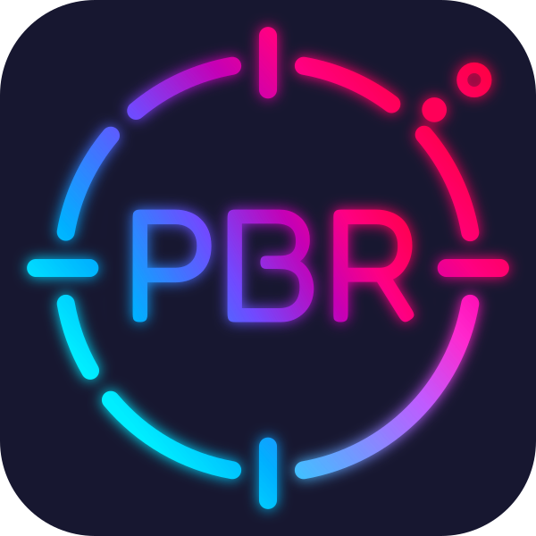
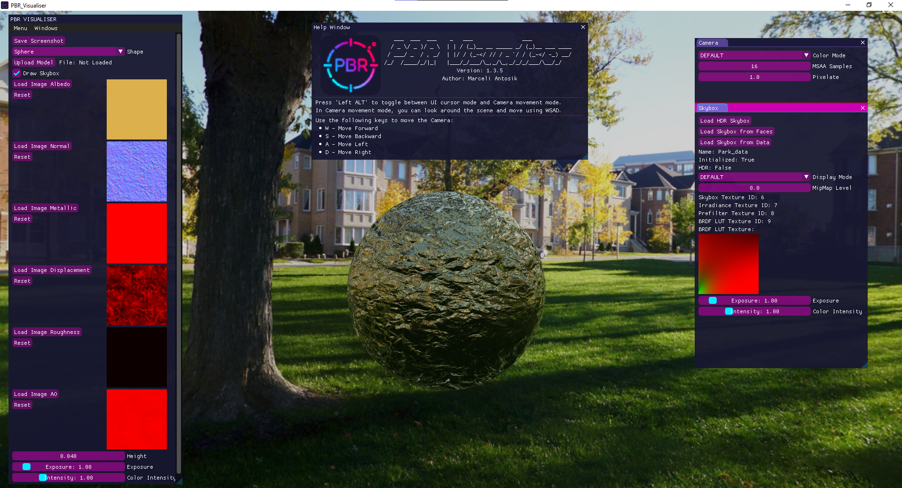
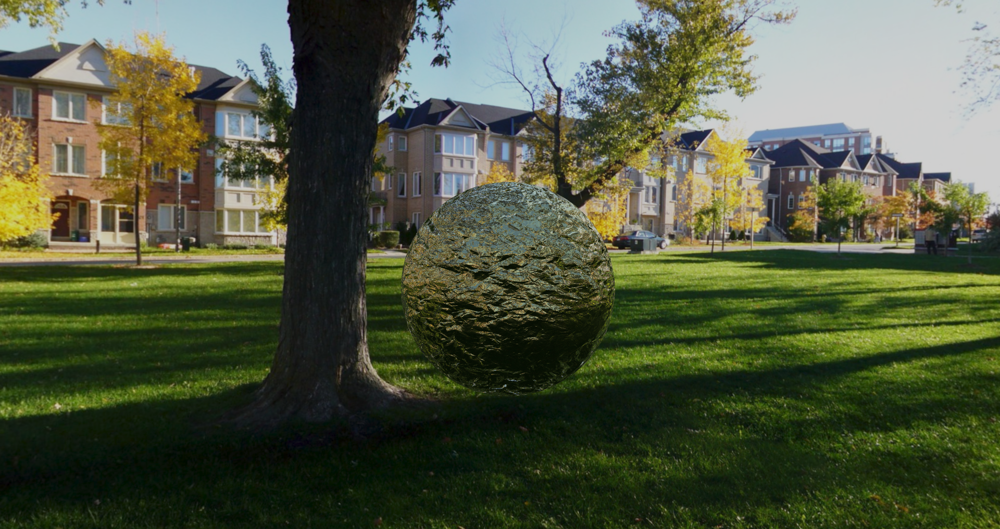

<div align='center'>
   
   
  <div id="toc">
    <ul style="list-style: none;">
      <summary>
        <h1>PBR Visualiser 1.3.5</h1>
      </summary>
    </ul>
  </div>
</div>

## 📌 Description
**PBR Visualiser** is an application for visualizing **PBR materials** in an **OpenGL** environment. The application supports two configurations:
<br/>
🎨 **Windowed (GUI)** – for rendering **3D models** with interactive camera and lighting settings.
<br/>
🖥️ **Console (CLI)** – for rendering **2D images** of PBR materials with customizable resolutions and lighting.

## 📋 Table of Contents

- [🌐 Acknowledgments](#-acknowledgments)
- [📚 Used Libraries](#-used-libraries)
- [🎨 Windowed Mode (GUI)](#-windowed-mode-gui)
- [🖥️ Console Mode (CLI)](#%EF%B8%8F-console-mode-cli)
- [⚙️ Requirements](#%EF%B8%8F-requirements)
- [✨ Authors](#-authors)
- [📜 License](#-license)

## 🌐 Acknowledgments
- 📦 **Sample materials**: [ambient.cg](https://ambient.cg/)
- 🌅 **Skyboxes**:
    - HDR files: [polyhaven.com](https://polyhaven.com/)
    - Park: [www.humus.name](http://www.humus.name/)
    - Tutorial: [learnopengl.com](https://learnopengl.com/)

## 📚 Used Libraries
- 🎮 **OpenGL** - rendering engine
- 🖱️ **ImGui** - UI handling (GUI mode)
- 📐 **GLM** - mathematical operations
- 🖼️ **GLI** - DDS file support
- 🏞️ **GLFW** - window & input handling
- 📜 **spdlog** - logging
- 📁 **cgltf** - loading GLTF/GLB objects
- 📦 **tiny_obj_loader** - OBJ file support
- 🖼️ **stbi_image** - image loading (HDR, JPG, PNG)
- 💾 **stbi_image_write** - image saving
- 🗂️ **tinyfiledialogs** - dialog windows

## 🎨 Windowed Mode (GUI)
- 🖥️ **User Interface**: **ImGui**  
- 🔳 **3D Shape Selection** from:
  - 🟦 Cube
  - 🟡 Sphere
  - 🔶 Plane (adjustable orientation)
- 📂 **3D Model Import**: OBJ, GLTF, GLB
- 🖌️ **PBR Texture Support**:
  - 🎨 **Albedo** (RGB)
  - 🌀 **Normal** (RGB)
  - 🔩 **Metalness** (Grayscale)
  - ⛰️ **Displacement** (Grayscale)
  - ✨ **Roughness** (Grayscale)
  - 🌑 **AO** (Grayscale)
- 🌅 **Skybox Selection**: HDR, JPG, PNG
- 💡 **Lighting Configuration**: Exposure & intensity
- 🎥 **Camera Filters**:
  - 🔷 Pixelation
  - ⚫ Grayscale
  - 🔀 Negative
  - ⚫🔀 Grayscale Negative
- 🎮 **MSAA** (up to 16 samples)
- 🎛️ **Camera Controls**:
  - 🖱️ **Mouse** – rotate (after press `Left Alt`)
  - ⌨️ **WSAD** – move (after press `Left Alt`)
- 📸 **Save Screenshots**
- 🗂️ **Dialog Windows** (via **tinyfiledialogs**)

📷 **Screenshot of the application:**


📷 **Screenshot taken in application:**


## 🖥️ Console Mode (CLI)
The application can run interactively (with sequential questions) or by passing parameters via the command line.

### ▶️ Usage:
```
PBR_Visualiser.exe ([-h] | [-I] | [-v] [-f <albedo_path> <normal_path> ...] [-n <output_name>] [-d <directory_path>] [-p <position>] [-s <skybox>] [-r <resolution>] [-e <exposure_value>] [-i <color_intensity>])
```

### ⚙️ Options:
- 🆘 `-h` → Displays **help**
- 🏗️ `-I` → **Interactive mode** (includes given parameters)
- 📜 `-v` → **Verbose mode** (detailed logs)
- 🖼️ `-f <image_path>` → Paths to max **6 PBR textures**
- 💾 `-n <output_name>` → **Output filename** (`PBR_Image.png`)
- 📂 `-d <directory_path>` → **Save location**
- 🏗️ `-p <position>` → **Plane position** (`top`, `bottom`, `front`, `back`, `right`, `left`)
- 🌅 `-s <skybox>` → **Skybox selection** (`park`, `hill`, `photostudio`, `bathroom`, `moonless_golf`, `snowy_field`, `venice_sunset`, `satara_night`, `golden_bay`)
- 🖥️ `-r <resolution>` → **Image resolution** (`r128`, `r256`, `r512`, `r1k`, `r2k`, `r4k`)
- ☀️ `-e <exposure_value>` → **Exposure** (`0 - 11`, default `1.0`)
- 🎨 `-i <color_intensity>` → **Color intensity** (`0 - 4`, default `1.0`)

### 📝 Example Execution:
```
PBR_Visualiser.exe -p right -f .\res\textures\Rock051_2K-PNG\Color.png .\res\textures\Rock051_2K-PNG\Normal.png .\res\textures\Rock051_2K-PNG\Metalness.png .\res\textures\Rock051_2K-PNG\Displacement.png .\res\textures\Rock051_2K-PNG\Roughness.png .\res\textures\Rock051_2K-PNG\AmbientOcclusion.png -n output -s golden_bay -r r128k -e 2.0 -i 1.0
```

For more examples, see [Examples.md](./Examples.md).

📷 **Example of a generated image:**
<div align="center">
  
</div>

## ⚙️ Requirements
✅ **For Building:**
- 🔑 OpenSSL
- 🛠️ CMake >= 3.21
- 🖥️ Git
- 🎮 OpenGL >= 4.5

✅ **For Running:**
- 🎮 OpenGL >= 4.5
- 📜 MSVCP140.dll
- 📜 VCRUNTIME140.dll
- 📜 VCRUNTIME140_1.dll

## ✨ Authors
👤 **Marceli Antosik (Muppetsg2)**

💡 If you have any questions or suggestions, feel free to contact me!


## 📜 License
📝 This project is **MIT Licensed**.

See the [LICENSE](./LICENSE) file for more details.

---

🚀 **Enjoy exploring PBR materials!** 🎨✨