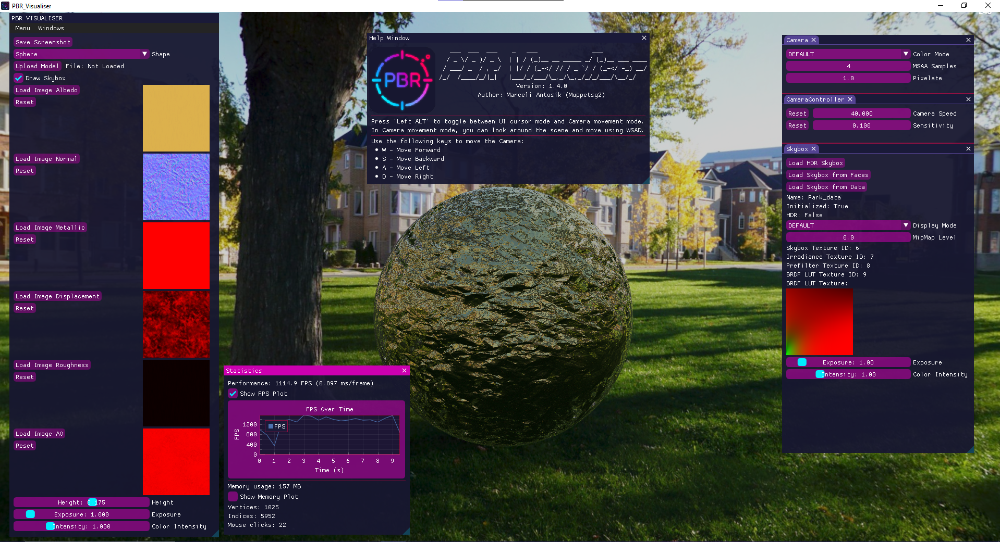

<div align='center'>
   
   <h1>
   PBR Visualiser 1.3.5
   </h1>
</div>

## 📌 Description
PBR_Visualiser is an application for visualizing PBR maps in an OpenGL environment. It supports the rendering of 3D models with different PBR materials and allows for interaction with the camera and lighting configuration. The application has two configurations: **windowed (GUI)** and **console (CLI)**.

---

## 🌐 Acknowledgments
- Sample materials used in the application have been sourced from ambient.cg.
- Skyboxes used in the application are sourced from:
    - polyhaven.com (All HDR files)
    - www.humus.name (Park)
    - learnopengl.com (Tutorial)

---

## 📚 Used Libraries
- **OpenGL** - for rendering content
- **ImGui** - for handling the user interface in the windowed configuration
- **GLM** - for mathematical operations
- **GLI** - for handling DDS files
- **GLFW** - for handling input devices and the window
- **spdlog** - for logging data to the console
- **cgltf** - for loading GLTF and GLB objects
- **tiny_obj_loader** - for loading OBJ objects
- **stbi_image** - for loading HDR, JPG, and PNG images
- **stbi_image_write** - for saving generated images
- **tinyfiledialogs** - for handling dialog windows

## 🎨 Windowed Mode (GUI)
- **User Interface** based on **ImGui**  
- **3D Shape Selection** from:
  - 🔳 Cube
  - 🟡 Sphere
  - 🔶 Plane (with orientation change option)
- **3D Model Import** from files:
  - OBJ
  - GLTF / GLB
- **PBR Texture Support**:
  - 🎨 Albedo (RGB)
  - 🌀 Normal (RGB)
  - 🔩 Metalness (Grayscale)
  - ⛰️ Displacement (Grayscale)
  - ✨ Roughness (Grayscale)
  - 🌑 AO (Grayscale)
- **Skybox Change**:
  - HDR files
  - 6 JPG/PNG files
  - Pre-generated auxiliary data (for faster loading)
- **Lighting Configuration**:
  - Exposure and intensity of the skybox
  - Exposure and intensity of the PBR material
- **Camera Filters**:
  - 🔷 Pixelation
  - ⚫ Grayscale
  - 🔀 Negative
  - ⚫🔀 Grayscale Negative
- **MSAA** up to 16 samples
- **Camera Controls**:
  - 🖱️ **Mouse** – rotate camera (after press `Left Alt`)
  - ⌨️ **WSAD** – move camera
- **Save Screenshots of the view**
- **Dialog Windows** handled via **tinyfiledialogs**

📷 **Screenshot of the application:**


📷 **Screenshot taken in application:**


---

## 🖥️ Console Mode (CLI)
The application can run interactively (with sequential questions) or by passing parameters via the command line.

#### ▶️ Usage:
```
PBR_Visualiser.exe ([-h] | [-I] | [-v] [-f <albedo_path> <normal_path> ...] [-n <output_name>] [-d <directory_path>] [-p <position>] [-s <skybox>] [-r <resolution>] [-e <exposure_value>] [-i <color_intensity>])
```

#### ⚙️ Options:
- `-h` → Displays help.
- `-I` → Interactive mode (includes the provided parameters in the first iteration).
- `-v` → Detailed information in the console.
- `-f <image_path>` → Paths to a maximum of 6 PBR images.
- `-n <output_name>` → Output file name (`PBR_Image.png`).
- `-d <directory_path>` → Save folder (by default it saves to the executable file folder).
- `-p <position>` → Plane position (`top`, `bottom`, `front`, `back`, `right`, `left`).
- `-s <skybox>` → Choose a skybox (`park`, `hill`, `photostudio`, `bathroom`, `moonless_golf`, `snowy_field`, `venice_sunset`, `satara_night`, `golden_bay`).
- `-r <resolution>` → Resolution (`r128`, `r256`, `r512`, `r1k`, `r2k`, `r4k`).
- `-e <exposure_value>` → Exposure (`0 - 11`, domyślnie `1.0`).
- `-i <color_intensity>` → Color intensity (`0 - 4`, domyślnie `1.0`).

#### 📝 Example execution:
```
PBR_Visualiser.exe -p right -f .\res\textures\Rock051_2K-PNG\Color.png .\res\textures\Rock051_2K-PNG\Normal.png .\res\textures\Rock051_2K-PNG\Metalness.png .\res\textures\Rock051_2K-PNG\Displacement.png .\res\textures\Rock051_2K-PNG\Roughness.png .\res\textures\Rock051_2K-PNG\AmbientOcclusion.png -n output -s golden_bay -r r128k -e 2.0 -i 1.0
```

For more example use cases, you can refer to the `Examples.md` file, where additional command-line executions and scenarios are provided.

📷 **Example of a generated image:**


---

## ⚙️ Requirements
✅ **For building:**
- OpenSSL
- CMake >= 3.21
- Git
- OpenGL >= 4.5

✅ **For running:**
- OpenGL >= 4.5
- MSVCP140.dll
- VCRUNTIME140.dll
- VCRUNTIME140_1.dll

---

## 📜 License
Project available under the **MIT** license.

---

## ✨ Authors
👤 **Marceli Antosik**

💡 If you have any questions or suggestions, feel free to contact me!

---

🚀 **Enjoy exploring PBR materials!** 🎨✨